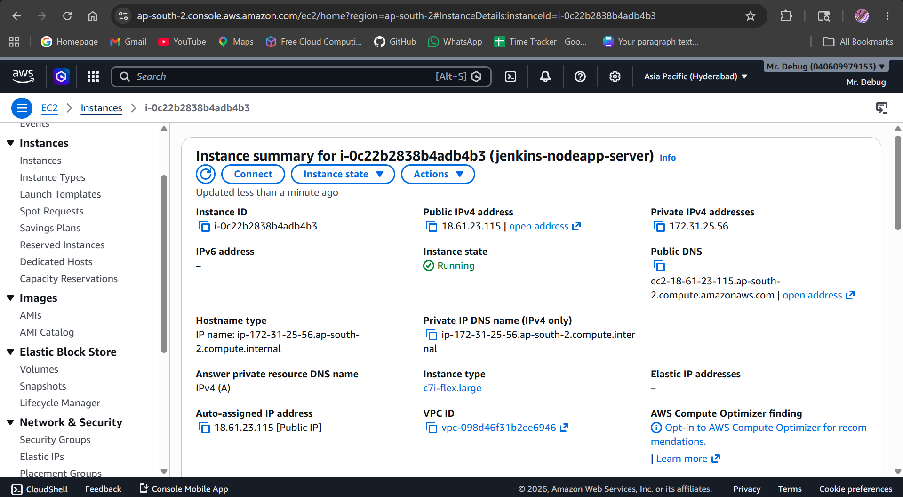
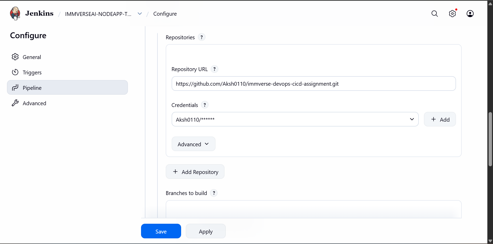
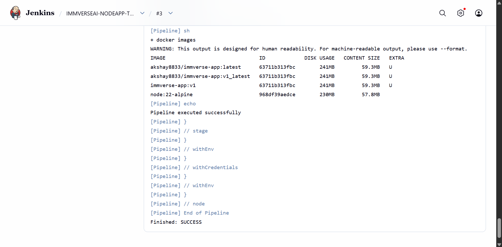

# DevOps CI/CD Assignment Report – Immverse AI

Author: Akshay Barapatre

---

# 1. Objective

Implement an automated CI/CD pipeline capable of:

- Building application
- Running tests
- Containerizing application
- Pushing image to Docker Hub
- Deploying to AWS EC2
- Monitoring infrastructure using Prometheus & Grafana

---

# 2. Environment Details

| Component | Value |
|-----------|--------|
| OS | Ubuntu |
| Cloud | AWS EC2 |
| CI/CD | Jenkins |
| Containerization | Docker |
| Registry | Docker Hub |
| Monitoring | Prometheus + Grafana |
| Runtime | NodeJS |

 

---

# 3. Application Development

Created Express application with:

Endpoints:

GET /

GET /health

Screenshot:
 

---

# 4. Dockerization

Dockerfile created.

Build:

```bash
docker build -t immverse-app:v1 .
```

Run:

```bash
docker run -d -p 3000:3000 immverse-app:v1
```

Insert screenshots:

 

---

# 5. Jenkins Setup

Installed Jenkins

Configured:

- Docker credentials
- Pipeline
- Git integration



---

# 6. CI/CD Pipeline

Pipeline stages:

1. Checkout
2. Build
3. Test
4. Docker Login
5. Push Image
6. Deploy
7. Health Check



---

# 7. Docker Hub Integration

Image pushed:

dockerhub-user/immverse-app:v1_latest


---

# 8. AWS EC2 Deployment

Container deployed.

Application accessible via:

http://18.61.23.115:3000


---

# 9. Monitoring Setup

## Node Exporter

Port:

9100

## Prometheus

Port:

9090

## Grafana

Port:

3001

Metrics monitored:

- CPU
- Memory
- Host metrics
- Health

 

---

# 10. Challenges Faced

### Issue 1

Git divergent branches

Resolution:

Used pull strategy configuration.

---

### Issue 2

node_modules accidentally committed

Resolution:

Configured .gitignore and removed cache.

---

### Issue 3

Docker permission denied in Jenkins

Resolution:

Added Jenkins user to docker group.

---

# 11. Final Result

Successfully implemented:

✓ CI/CD pipeline

✓ EC2 deployment

✓ Dockerization

✓ Monitoring

✓ Automated deployment

---

# 12. Future Improvements

- Terraform
- Kubernetes
- SonarQube
- Slack notifications
- Helm
- Multi-stage Docker builds

---

# 13. Conclusion

Successfully implemented an end-to-end DevOps workflow using GitHub, Jenkins, Docker, AWS EC2, Prometheus and Grafana.