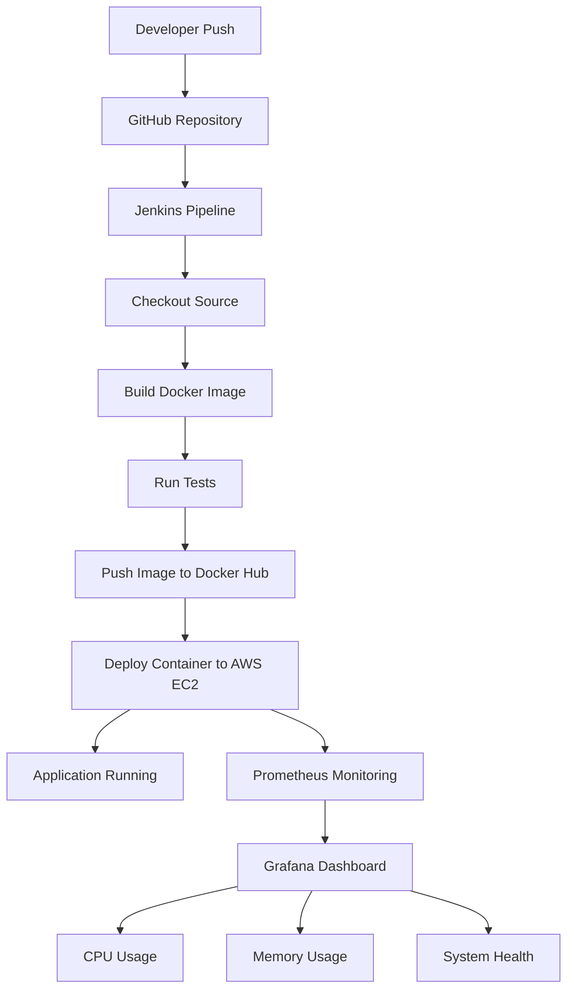

# DevOps CI/CD Pipeline Assignment – Immverse AI

## Project Objective

Design and implement an automated CI/CD pipeline that builds, tests, containerizes, and deploys an application to AWS EC2 while enabling monitoring using Prometheus and Grafana.

---

## Tech Stack

- Git & GitHub
- Jenkins
- Docker
- Docker Hub
- AWS EC2 (Ubuntu)
- Node.js (Express)
- Prometheus
- Grafana

---

## Architecture Diagram



## Repository Structure

```bash
immverse-devops-cicd-assignment/

├── app/
│     ├── app.js
│     ├── package.json
│     ├── Dockerfile
│     └── .dockerignore
│
├── monitoring/
│     ├── prometheus/
│     │       └── prometheus.yml
│     └── grafana/
│
├── screenshots/
│
├── Jenkinsfile
├── DevOps_CICD_Assignment_Report.md
├── README.md
├── .env.example
└── .gitignore
```

---

## Application Setup

Clone repository:

```bash
git clone https://github.com/Aksh0110/immverse-devops-cicd-assignment.git

cd immverse-devops-cicd-assignment/app

npm install

npm start
```

Access:

```text
http://18.61.23.115:3000
```

Health Endpoint:

```text
http://18.61.23.115:3000/health
```

---

## Docker Setup

Build image:

```bash
docker build -t immverse-app:v1_latest .
```

Run:

```bash
docker run -d \
-p 3000:3000 \
--name immverse-container \
immverse-app:v1_latest
```

---

## Jenkins Pipeline Stages

Pipeline performs:

- Checkout source code
- Build Docker image
- Run tests
- Docker Hub authentication
- Push image
- Deploy container
- Health validation

Execute automatically on repository updates.

---

## Deployment

Application deployed on:

AWS EC2 Instance

Container execution:

```bash
docker run -d \
-p 3000:3000 \
akshay8833/immverse-app:v1_latest
```

---

## Monitoring Setup

Monitoring stack:

### Prometheus

Collects:

- CPU metrics
- Memory metrics
- Host metrics
- Exporter metrics

### Grafana

Visualizes:

- CPU utilization
- Memory utilization
- Network activity
- System health

---

## URLs

Application:

```text
http://18.61.23.115:3000
```

Jenkins:

```text
http://18.61.23.115:8080
username - Akshay
password - Akshay@8833
```

Prometheus:

```text
http://18.61.23.115:9090/targets
```

Grafana:

```text
http://18.61.23.115:3001
```

---

## Screenshots

Include screenshots for:

- GitHub repository
- Jenkins pipeline success
- Docker images
- Running containers
- Application URL
- Prometheus targets
- Grafana dashboard

---

## Challenges Encountered

1. Git divergence during pull operation
2. Accidental node_modules commit
3. Docker permission issue with Jenkins user
4. Monitoring target configuration

Resolved using Git cleanup, Docker group permissions and Prometheus target adjustments.

---

## Future Improvements

- Kubernetes deployment
- Infrastructure as Code using Terraform
- Helm charts
- SonarQube integration
- Slack notifications
- Multi-stage Docker builds

---

## Author

Akshay Barapatre  
DevOps Engineer | AWS | Docker | Jenkins | Linux | Monitoring


